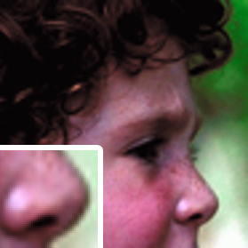
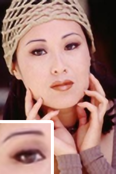
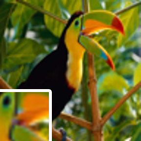
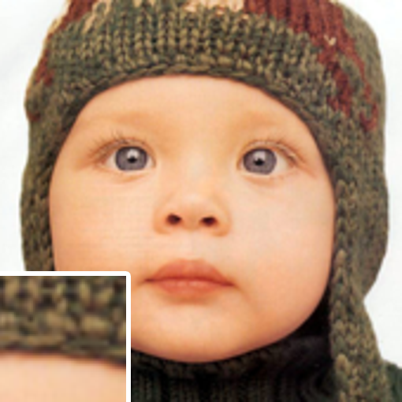

# Super Resolution Convolutional Neural Network (SRCNN)

### SRCNN implementations for Python/Torch, Numpy and Avnet's ZedBoard 

The aim of single image super-resolution is to recover a high-resolution image from a single low-resolution image.

This repository includes three implementations of the *Super Resolution Convolutional Neural Network (SRCNN) by Dong, Chao, et al. "Image super-resolution using deep convolutional networks."* (https://arxiv.org/abs/1501.00092v3)

## Summary

* 9-5-5 Convolutional Neural Network
* Three implementations
  * Torch: For training the network, extracting weights and upscaling
  * Numpy: For upscaling
  * Cython: For upscaling (able to be run on Avnet's [ZedBoard](http://zedboard.org/product/zedboard))
    * Purely CPU-run *or*
    * Running the 2D convolutions on the ZedBoard's FPGA

## Usage

See the README.md files of the respective implementation in their folders for usage instructions and prerequisites:
* [Torch](./Torch/)
* [Numpy](./Numpy/)
* [Cython](./Cython/)

## Metrics

Average of each metric for the Set5 dataset.

| Metric | Bicubic |   SCA | NE+LLEA |   KKA |  ANRA |       A+A | SRCNN (Dong) | SRCNN (Ours) |
| :----- | ------: | ----: | ------: | ----: | ----: | --------: | -----------: | -----------: |
| PSNR   |   29.56 | 31.42 |   31.84 | 32.28 | 31.92 |     32.59 |    **32.75** |        31.92 |
| SSIM   |   0.871 | 0.882 |   0.896 | 0.903 | 0.897 |     0.909 |        0.909 |    **0.913** |
| IFC    |    3.49 |  3.16 |    4.40 |  4.14 |  4.52 |  **4.84** |         4.58 |         4.41 |
| NQM    |   27.93 | 27.29 |   32.77 | 32.10 | 33.10 | **34.48** |        33.21 |        33.04 |
| MSSSIM |   0.975 | 0.980 |   0.984 | 0.985 | 0.984 | **0.987** |    **0.987** |    **0.987** |

## Examples
* **Ground truth** is the original (ideal) image for comparison with the upscaled versions.  
* **Bicubic** is the ground truth downscaled by a factor of 3 and upscaled by a factor of 3 using simple bicubic interpolation.  
* **SRCNN** is the same as Bicubic but using the trained convolutional neural network.

|           Ground Truth           |               Bicubic x3               |               SRCNN x3               |
| :------------------------------: | :------------------------------------: | :----------------------------------: |
|  |  |  |
|         |       |       |
|        |      |      |
|         |       |       |
|         |       |       |